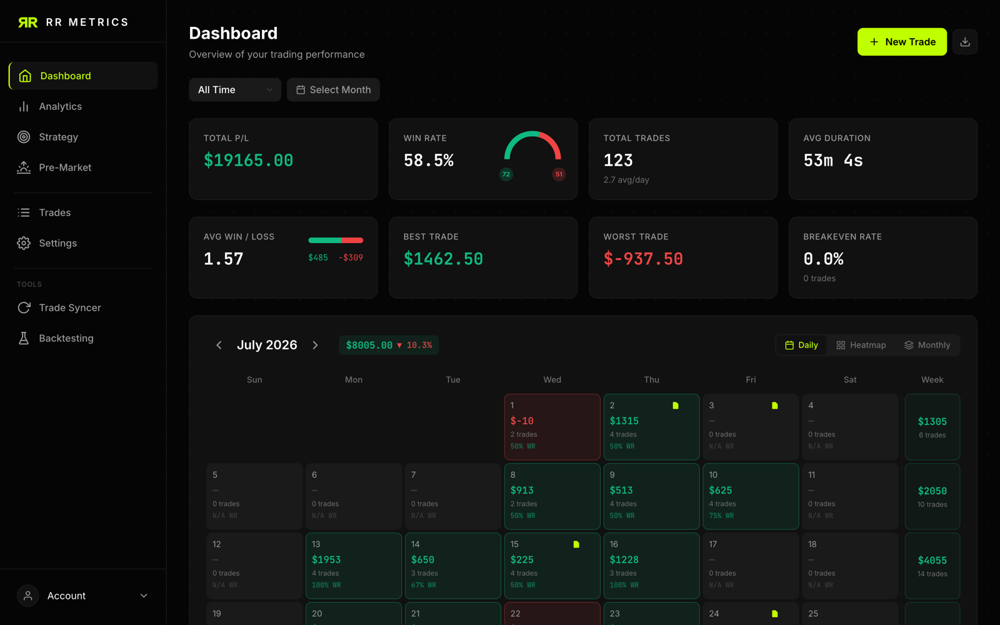
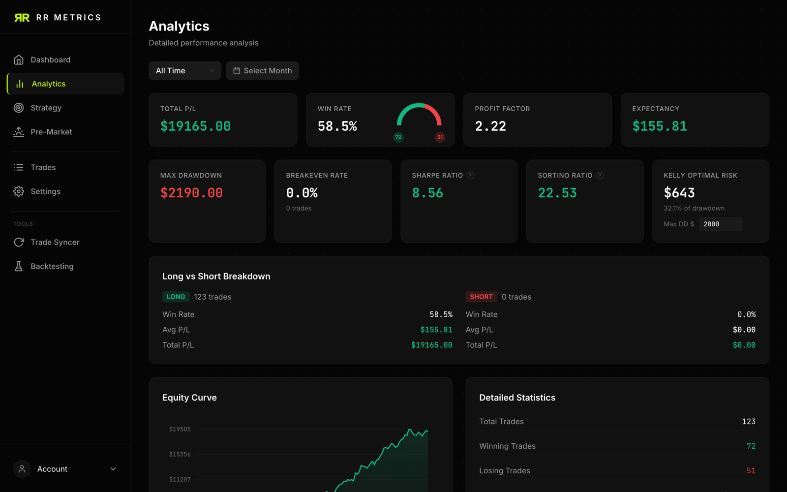
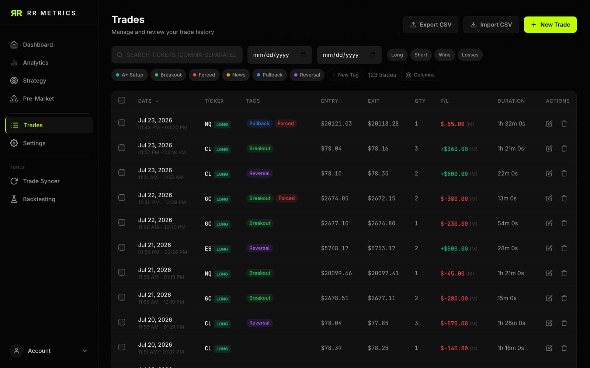
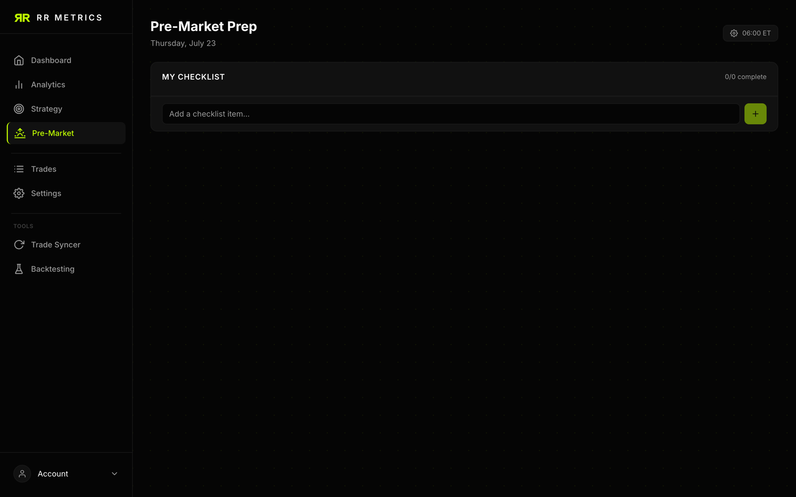
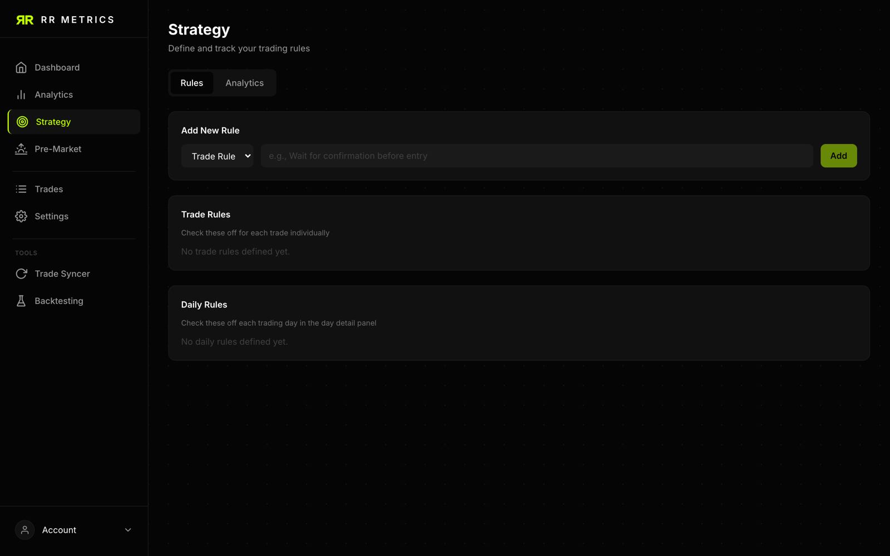
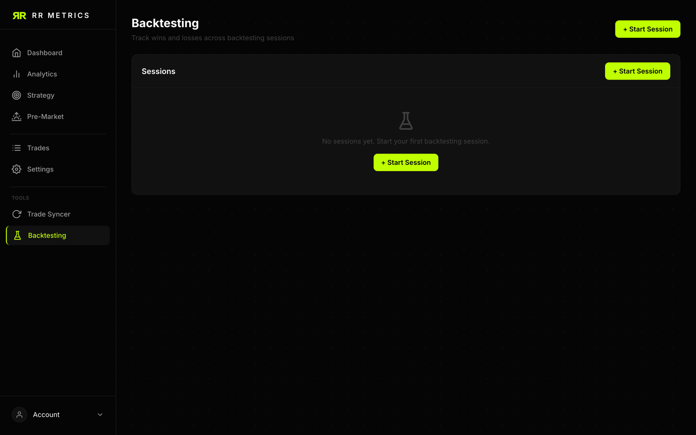
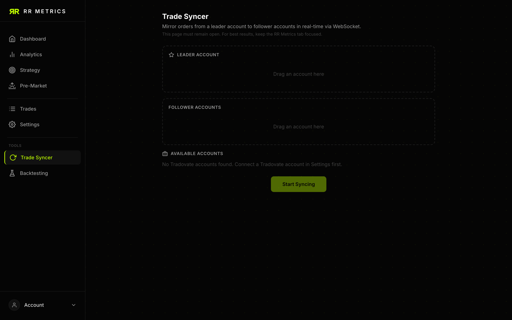
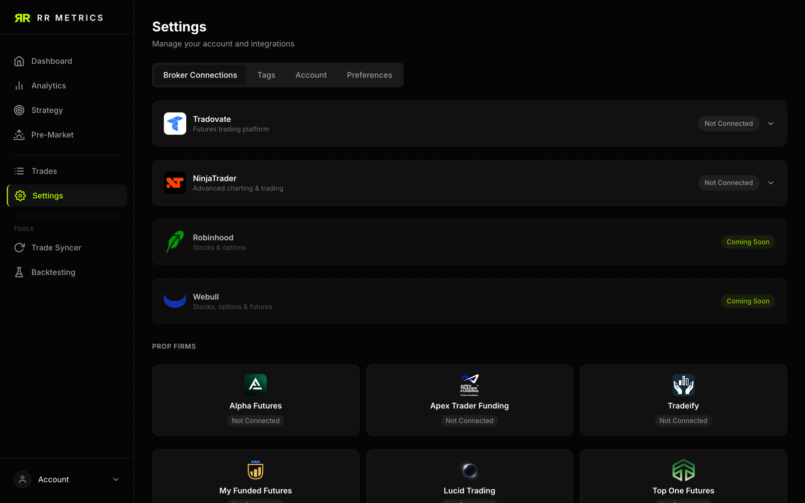

# RR Metrics

**Open-source, self-hosted trading journal.** Log your trades, sync them automatically from your broker, and analyze your performance — all on your own machine, in a single SQLite file you own.

**Website:** [rrmetrics.com](https://rrmetrics.com)

[](LICENSE)
[](https://nodejs.org)
[](CONTRIBUTING.md)



<details>
<summary>More screenshots</summary>









</details>

## Why RR Metrics?

Most trading journals are subscription SaaS products that hold your trade history hostage. RR Metrics runs entirely on your own hardware: no cloud services, no Docker required, no telemetry, no monthly fee. Your data lives in one `data/` folder that you can back up with a copy-paste.

## Features

- **Trade journal** — manual entry, CSV import/export, per-trade comments, tags, and screenshot attachments (with markup)
- **Dashboard** — P/L calendar with daily, heatmap, and monthly views
- **Analytics** — equity curve, win rate, profit factor, expectancy, Sharpe and Sortino ratios, Kelly criterion, max drawdown, long/short breakdown
- **Broker auto-sync** — Tradovate, TopstepX (ProjectX), Webull, and Robinhood, with automatic hourly token refresh
- **Trade Syncer** — mirror orders live from a leader account to follower accounts (Tradovate-based accounts, per-follower size multipliers)
- **Discipline tools** — pre-market checklist, daily notes, strategy rule tracking per trade and per day
- **Backtesting sessions** — log and review backtests separately from live trades
- **Dark and light themes**

## Quick Start

### One-command install

```bash
curl -fsSL https://raw.githubusercontent.com/Snoe0/rrmetrics/main/install.sh | bash
```

The script checks for Node.js 20+, clones the repo, installs dependencies, and builds the client.

### Manual install

```bash
git clone https://github.com/Snoe0/rrmetrics.git
cd rrmetrics
npm install
npm run build
```

### Run

```bash
npm start
```

Open http://localhost:8459 — that's it, no login. RR Metrics is single-user and fully local: the first run automatically creates the `data/` directory with the SQLite database, a screenshots folder, and a server secret key (used to encrypt broker credentials at rest). There are no accounts, passwords, or third-party auth.

### Try it with demo data

```bash
npm run seed-demo
```

This fills the journal with realistic sample trades — just open the app to explore it.

## Usage Basics

- **Add trades** manually from the Trades page, or import a CSV from your broker's export.
- **Export** your journal to CSV at any time.
- **Attach screenshots** to trades — they're stored locally in `data/screenshots/`.

## Broker Sync

All broker integrations are optional — RR Metrics works fully as a manual journal without any of them. Each integration needs credentials that *you* supply; connected tokens are encrypted at rest and refreshed automatically every hour.

### TopstepX / ProjectX (simplest to set up)

Enter your ProjectX username and API key directly in **Settings → Broker Sync** — no server configuration needed.

> **Cost note:** Topstep sells API access to TopstepX through the ProjectX Gateway (roughly $29/month at the time of writing). Other ProjectX-based prop firms have their own API access terms.

### Tradovate

Tradovate sync uses OAuth, so the server needs an API client:

1. Obtain Tradovate API access and create an OAuth client. **Heads up:** Tradovate API access is not free — it requires approval and payment on their side.
2. Register this redirect URI with Tradovate (replace with your actual `APP_URL`):

   ```
   http://localhost:8459/api/tradovate/callback
   ```

3. Set `TRADOVATE_CLIENT_ID` and `TRADOVATE_CLIENT_SECRET` in `.env`, restart, and connect from **Settings**. Both demo and live environments are supported.

### Webull

1. Create a developer app with Webull's OpenAPI program to get an App ID and Secret.
2. Register the redirect URI `<APP_URL>/api/webull/callback`.
3. Set `WEBULL_APP_ID` and `WEBULL_APP_SECRET` in `.env`, restart, and connect from **Settings**.

### Robinhood

Connect with your Robinhood email and password from **Settings**. Your credentials are used once to log in and are never stored — only the resulting session tokens are kept (encrypted). No server configuration required.

> **Caveat:** Robinhood has no official public API for this, so the integration uses the same endpoints as their own apps and may break if Robinhood changes them.

### Trade Syncer

The Trade Syncer mirrors orders in real time from a **leader** account to one or more **follower** accounts (with a size multiplier per follower). It works across your connected Tradovate-based accounts and runs while the app is open in your browser.

### Roadmap

More brokers are planned — Interactive Brokers is high on the list. If you'd like to add one, the integration pattern is documented in [CONTRIBUTING.md](CONTRIBUTING.md); contributions are very welcome.

## Configuration

RR Metrics runs with zero configuration. Every variable is optional — copy [.env.example](.env.example) to `.env` only if you need to change something.

| Variable | Default | Purpose |
|---|---|---|
| `PORT` | `8459` | Port the HTTP server listens on |
| `APP_URL` | `http://localhost:<PORT>` | Public base URL; used to build broker OAuth redirect URIs |
| `DATA_DIR` | `./data` | Directory for the SQLite database, screenshots, and secret key |
| `ENCRYPTION_KEY` | auto-generated | 64-char hex key encrypting broker credentials at rest (`openssl rand -hex 32`) |
| `TRADOVATE_CLIENT_ID` / `TRADOVATE_CLIENT_SECRET` | — | Tradovate OAuth client (Tradovate sync only) |
| `WEBULL_APP_ID` / `WEBULL_APP_SECRET` | — | Webull OpenAPI app (Webull sync only) |

## Data & Backup

Everything lives in the `data/` directory:

```
data/
├── rrmetrics.db    # SQLite database (all trades, notes, settings, connections)
├── screenshots/    # uploaded trade screenshots
└── secret.key      # auto-generated server secret (signs sessions, encrypts tokens)
```

**To back up, copy the `data/` folder.** To restore or migrate to a new machine, copy it back before starting the server. Keep `secret.key` with the database — without it, stored broker tokens can't be decrypted and sessions are invalidated.

## Self-Hosting Notes

- The server binds to the port from `PORT` (default 8459). Run it on a home server, NAS, VPS, or Raspberry Pi — anything with Node 20+.
- To access it from outside localhost, put it behind a reverse proxy (Caddy, nginx, Traefik) with HTTPS, and set `APP_URL` to your public URL so broker OAuth callbacks resolve correctly.
- For always-on operation, run `npm start` under a process manager such as `systemd` or `pm2`.

## Tech Stack

- **Server:** Node.js 20+, [Hono](https://hono.dev), TypeScript (run via `tsx` — no compile step)
- **Database:** SQLite via [better-sqlite3](https://github.com/WiseLibs/better-sqlite3) (WAL mode, single file)
- **Client:** React 19, Tailwind CSS, Framer Motion, bundled by webpack to `public/assets`
- **Auth:** none — single-user, local-only

## Contributing

This is a young open-source project and contributions of every size are welcome — bug reports, docs fixes, new broker integrations, features. See [CONTRIBUTING.md](CONTRIBUTING.md) for dev setup, project layout, and the broker-integration guide.

## Contributors

Thanks to everyone who has contributed to RR Metrics!

<a href="https://github.com/Snoe0/rrmetrics/graphs/contributors">
  
</a>

## Acknowledgments

RR Metrics was originally bootstrapped years ago from an Express MVC course boilerplate by Cody Van De Mark and Austin Willoughby. The codebase has been fully rewritten since, but credit where it's due for the starting point.

## License

[Apache 2.0](LICENSE)
